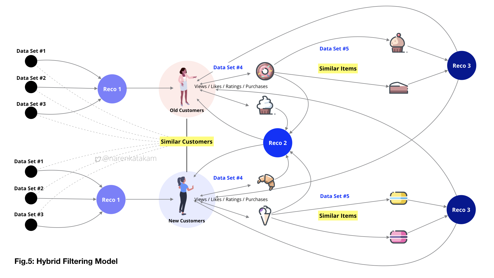
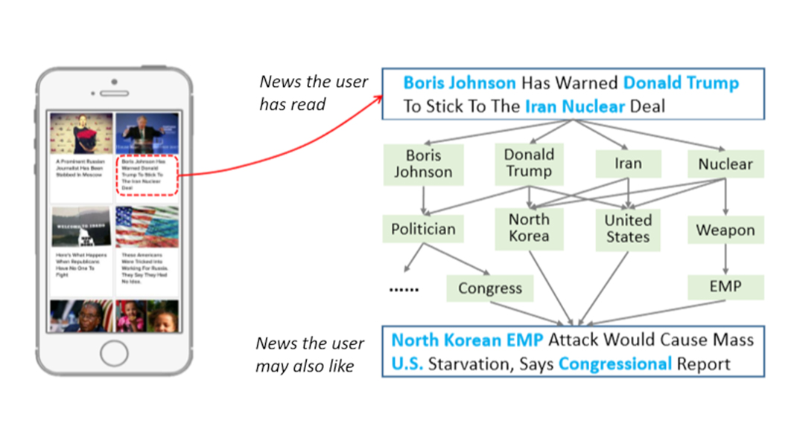

# Recommendation_System-PyTorch
Prodcution-level implementations of recommender system Full Pytorch Implementation

#### Recommendation-System Common Architecture (Hybrid Filtering Model)

#### Abstract
Recommender systems are tools for interacting with large and complex information spaces. They provide a personalized view of such spaces, prioritizing items likely to be of interest to the user. The field, christened in 1995, has grown enormously in the variety of problems addressed and techniques employed, as well as in its practical applications. Recommender systems research has incorporated a wide variety of artificial intelligence techniques including machine learning, data mining, user modeling, case-based reasoning, and constraint satisfaction, among others. Personalized recommendations are an important part of many online ecommerce applications such as Amazon.com, Netflix, and Pandora. This wealth of practical application experience has provided inspiration to researchers to extend the reach of recommender systems into new and challenging areas. The purpose of the articles in this special issue is to take stock of the current landscape of recommender systems research and identify directions the field is now taking. This article provides an overview of the current state of the field and introduces the various articles in the special issue. Copyright © 2011, Association for the Advancement of Artificial Intelligence. All rights reserved. (Link to [Full Article](https://www.researchgate.net/publication/220604600_Recommender_Systems_An_Overview))

#### Example

## Data
- MovieLens Data 100k & 1M ([download](https://grouplens.org/datasets/movielens/))
- Data files are in "data" folder

## Model Zoo
| Model    | Paper                                                                         |
|------------------|-----------------------------------------------------------------------|
| BPRMF            | [Link](https://arxiv.org/pdf/1205.2618) |
| ItemKNN          | [Link](http://web4.cs.ucl.ac.uk/staff/jun.wang/papers/2006-sigir06-unifycf.pdf) |
| SLIM             | [Link](http://glaros.dtc.umn.edu/gkhome/fetch/papers/SLIM2011icdm.pdf) |
| MultVAE          | [Link](https://arxiv.org/pdf/1802.05814) |

## Training 
    $ python main.py 
                --model YOUR MODEL (default: SLIM)
                --data_dir [YOUR DIRECTORY]
                --save_dir [YOUR SAVE DIRECTORY]
                --conf_dir [YOUR CONFIGURATION DIRECTORY] \ (i.e. './drive/My Drive/Python/Recommendation_System-PyTorch/config' 
                --seed YOUR SEED 

## Result
Plese refer to [Python Notebook](https://github.com/hyunjoonbok/Recommendation_System-PyTorch/blob/master/run_main.ipynb) that ran 1 sample epoch for the model SLIM (default)
Modify methods in other python files to increase epoch and change other hyperparameters

## Create your own model
1. Create 'Yourmodel.py' that inherits 'BaseModel.py'
2. Create 'YourModel.json' file in 'config' folder
3. Implement necessary class and add additional methods if you want.
4. Add your model in 'ModelBuilder.py'
5. Run 'main.py' with edited parameters

## Reference
- Facebook Group [Link](https://www.facebook.com/groups/2611614312273351)
- Facebook Group [Link](https://www.facebook.com/groups/PyTorchKR)
- Recommendation in Pytorch [github](https://github.com/yoongi0428/RecSys_PyTorch/blob/master/README.md) - util.py / Tools.py
- RecSys 2019 [github](https://github.com/MaurizioFD/RecSys2019_DeepLearning_Evaluation) - util.py / Tools.py
- NeuRec [github](https://github.com/wubinzzu/NeuRec)
